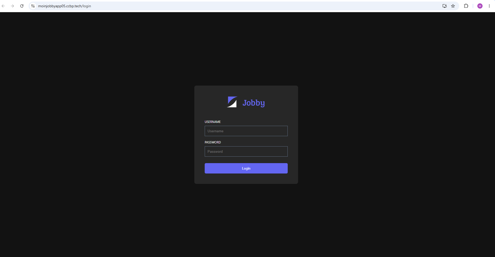
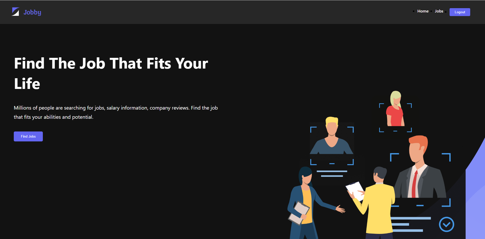
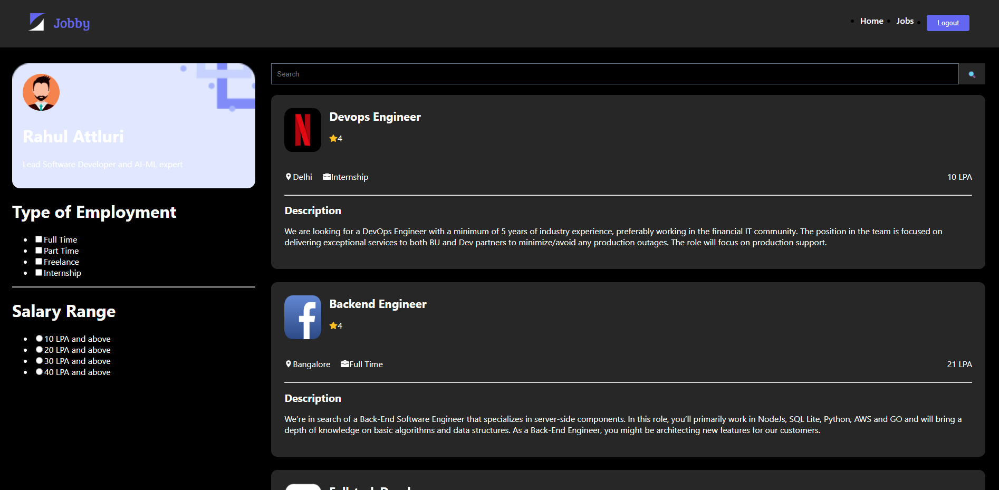
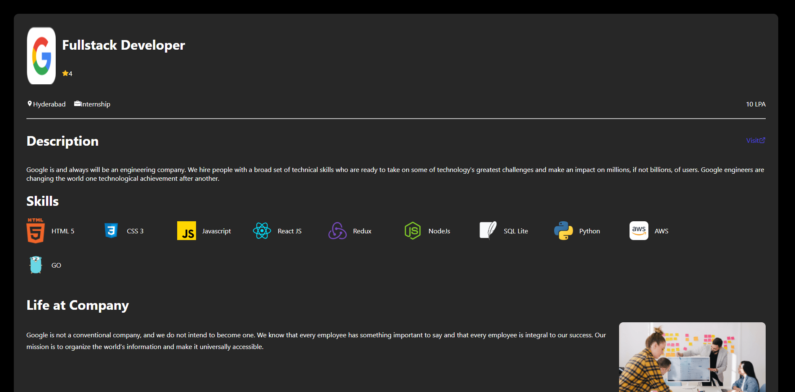

# Jobby App 💼

A full-featured Job Portal built using React.js.

## 🌐 Live Demo

👉 https://moinjobbyapp05.ccbp.tech/login

---

## Login Credentials

Username:
```
rahul
```

Password:
```
rahul@2021
```

---

## Features

- JWT Authentication
- Protected Routes
- Job Search
- Employment Filters
- Salary Filters
- Company Profiles
- Job Details
- Similar Jobs
- Responsive UI
- REST API Integration

---

## Tech Stack

- React.js
- React Router
- JavaScript
- CSS3
- REST APIs
- JWT Authentication

---

## Screenshots

### Login



### Home



### Jobs



### Job Details



---

## Installation

```bash
npm install
npm start
```

---

## Author

Mohammed Khaja Moinuddin

LinkedIn:
https://www.linkedin.com/in/mohammed-khaja-moinuddin05/
